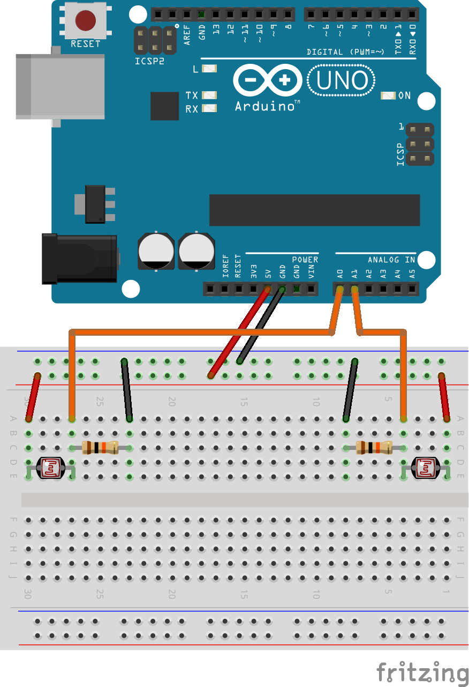
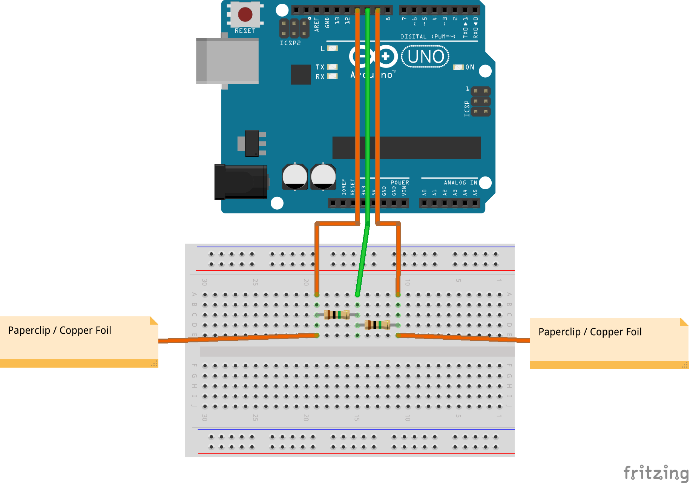

1.  Replace the potentiometers with a voltage divider consisting of a light-dependent resistor and a 10 k&Omega; resistor, as in the following circuit:

    
    
    Note that the LDR circuits now never reach either extreme of their range. Read about [the `map` function](http://arduino.cc/en/reference/map) and see if you can resolve this issue.

2.  Replace the LDRs with capacitive sensing inputs, using a 1 M&Omega; resistor as in the following circuit:

    
    
    Then, replace the `getAValue` and `getBValue` functions with the following code:
    <%= capsense.ino =%>
    Download and install [the capacitive sensing library](https://github.com/workshopweekend/CapacitiveSensor/releases/download/v0.1/CapacitiveSensor.zip). Learn more about capacitive sensing at the [Arduino playground](http://playground.arduino.cc/Main/CapacitiveSensor).